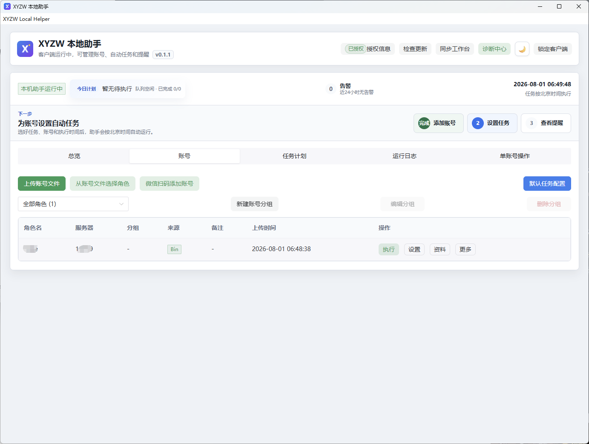
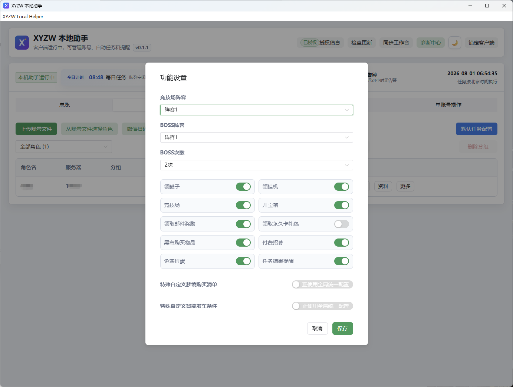
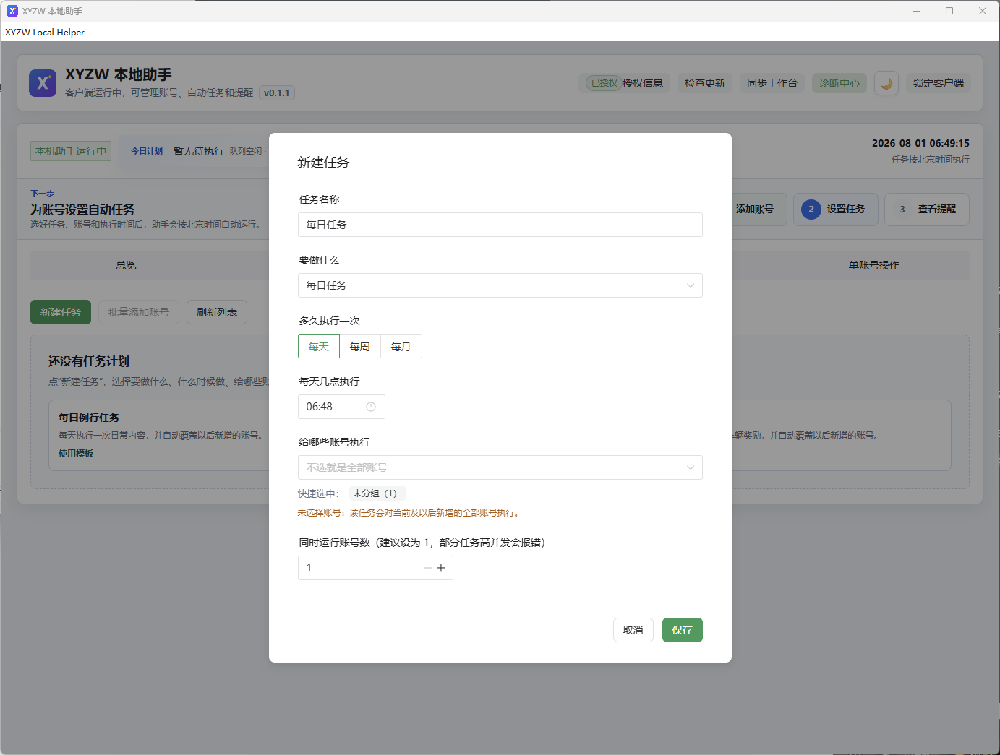
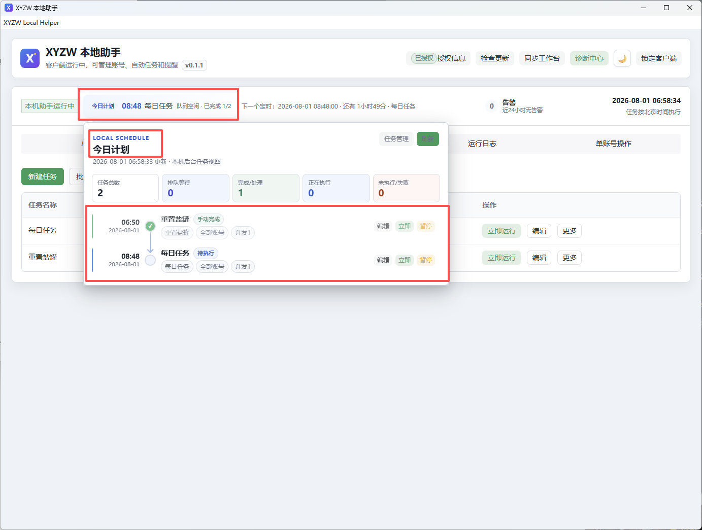
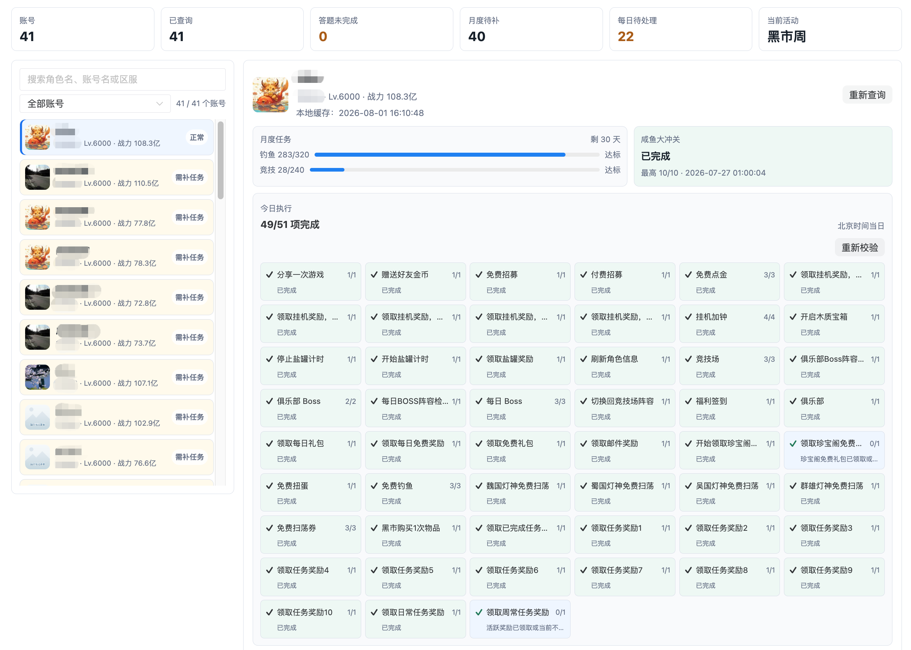
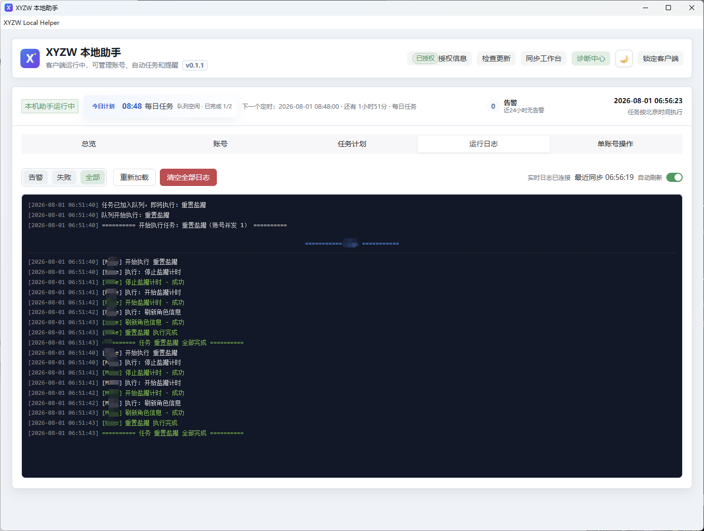
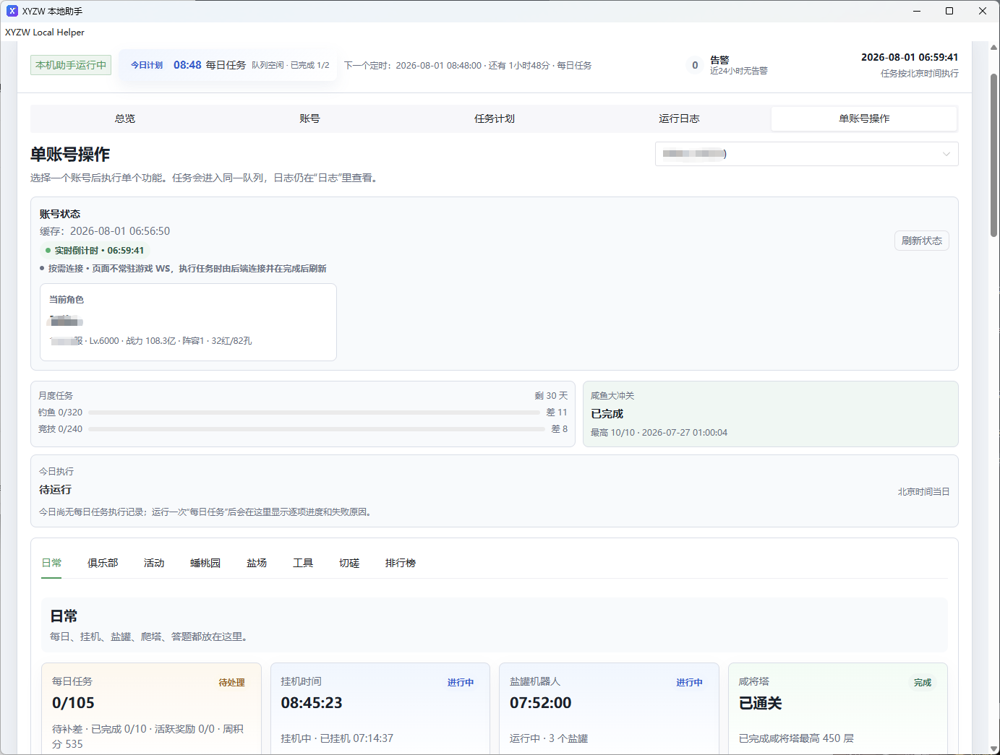

# XYZW 本地助手

本地运行的桌面助手，支持 Windows 和 MacOS，提供多账号管理、定时任务、任务进度、运行日志和阵容配置。

> 助手的配置和日志默认保存在本机；执行任务时会与游戏服务器通信。

## 功能预览

### 多账号与个性化配置

导入和管理多个账号，并为每个账号单独设置阵容、BOSS 次数和日常功能。

  
  

### 定时任务与今日计划

按每天、每周或每月创建自动任务，清楚查看今天的排队、执行和完成情况。

  
  

### 进度总览与运行日志

集中查看账号进度、阵容状态和实时执行日志；出现问题时可快速定位任务结果。

  
  

### 单账号操作

需要时可进入单账号页面，查看状态、今日执行记录和各项功能进度。

  

## 下载与安装

请前往 [Releases](../../releases) 页面，按设备系统下载最新安装包：

- **Windows**：下载 `.exe` 安装包（文件名包含 `win-x64`）；
- **MacOS**：下载 `.dmg` 安装包（文件名包含 `mac`）。

请不要在 MacOS 上运行 `.exe`，也不要在 Windows 上打开 `.dmg`。

### Windows 安装

安装前请先退出正在运行的 XYZW Local Helper，再双击 `.exe` 安装程序并按提示完成安装或升级。应用数据和本地配置会保留在原位置。

### MacOS 安装

下载 `.dmg` 后双击打开，将 **XYZW Local Helper** 拖到“应用程序（Applications）”文件夹。升级前请先退出正在运行的客户端；本地数据和配置会保留在原位置。

如果 MacOS 首次提示无法确认开发者，请确认安装包来自本仓库 Release，随后在“系统设置 → 隐私与安全性”中选择仍要打开。

## 应用内升级

已安装的客户端可使用界面的“检查更新”功能获取新版本。客户端会先校验更新清单的签名和安装包的 SHA-256 值，再提示下载。

下载完成后，请退出客户端并运行下载的安装程序完成更新：Windows 运行下载的 `.exe`，MacOS 打开下载的 `.dmg` 并替换“应用程序”中的旧版本。

## 校验文件

每个发布版本可能包含以下文件：

- `SHA256SUMS-<version>-win.txt`：Windows安装包的 SHA-256 校验值；
- `UNSIGNED-WINDOWS-RELEASE-<version>.txt`：未使用 Windows 代码签名证书时的说明；
- `SHA256SUMS-<version>-mac.txt`：MacOS安装包的 SHA-256 校验值；
- `UNSIGNED-MACOS-RELEASE-<version>.txt`：未使用 MacOS 代码签名证书时的说明；

请仅从本仓库的 Releases 页面或客户端内置更新功能获取安装包。

## Windows 安全提示

部分预览版安装包尚未使用 Windows 代码签名证书，Windows 可能显示“未知发布者”或 SmartScreen 提示。请确认下载来源为本仓库的 Release，并核对版本号与 SHA-256 校验文件后再继续安装。

## MacOS 安全提示

MacOS 会验证应用来源和签名。请只从本仓库的 Release 下载 `.dmg`；若系统提示应用无法打开，请先确认版本、发布来源和校验文件，再通过“系统设置 → 隐私与安全性”允许打开。不要使用来历不明的“修复工具”绕过系统安全提示。

## 支持

如遇到安装、更新或激活问题，请通过下方微信联系支持人员，并附上客户端版本号和相关错误信息。请不要发送账号文件、Token 或密码。

  

微信号：`MikeLearnsIT`（无法扫码时可直接在微信搜索添加；请备注“XYZW 本地助手”）。

[发邮件给我](mailto:mikeyuan90@gmail.com)

## TG群

[进群体验邀请码](https://t.me/+LsqSoaOyskk4MjBl)
